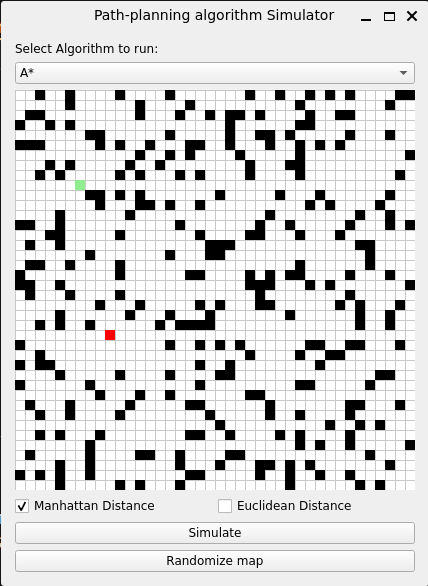
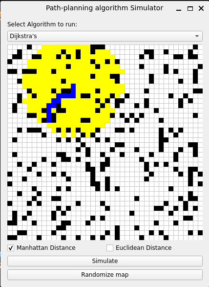
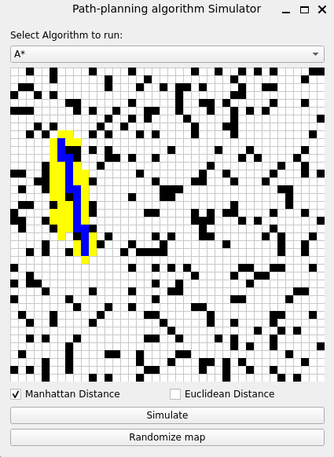

# Path Planning Simulator

An interactive simulator to showcase the Dijsktra's and A* search algorithms. **Note: The simulator is constantly being worked on, and I plan on adding new motion planning algorithms to the simulator to demonstrate. Currently, I'm working on implementing D\* and RRT\***.

## Installation
Install the necessary dependencies using this command in your shell
```python
pip install -r requirements.txt
```
The dependencies that will be installed are
* **numpy** - For array operations. Numpy documentation can be found [here](https://numpy.org/doc)
* **pyqt6** - The PyQt6 UI library. PyQt6 documentation can be found [here](https://doc.qt.io/qtforpython-6/)

## Running the simulator
When you start off the simulator, you will be greeted with a basic UI as shown below





The dropdown box allows you to choose which algorithm you want to simulate. By default, A* is selected. The main window shows the obstacle map
* Black pixels are obstacles
* <span style="color:red">Red</span> pixels are goal nodes
* Green pixels are start nodes
* Yellow pixels are the nodes that have been searched
* Blue pixels are the nodes that belong to the final path computed by the algorithm
You can also select with distance metric you want the algorithm to use between Manhattan (or Taxicab) distance or Euclidean distance.
* Simulate - Once the algorithm and the distance metric is chosen, pressing this button will begin the simulation
* Randomize map - Pressing this button will re-scatter all nodes to produce a random obstacle map
The simulation also times the algorithm's runtime, which is display in a terminal window for now

Here's how the simulation results look like for the Dijkstra's and A* algorithm respectively 





