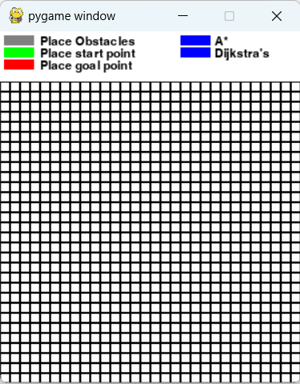
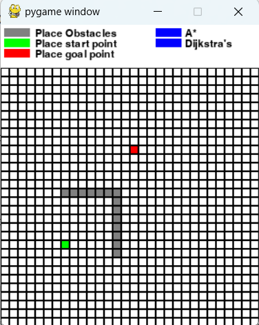
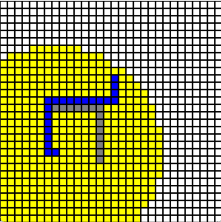
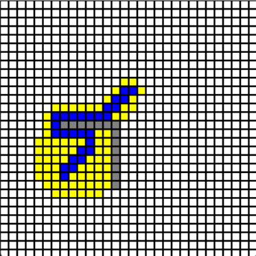

# Path Planning Simulator

An interactive simulator to showcase the Dijsktra's and A* search algorithms

## Installation
Install the necessary dependencies using this command in your shell
```python
pip install -r requirements.txt
```

## Running the simulator
When you start off the simulator, you will be greeted with a basic UI as shown below

You should draw an obstacle map before running the simulator, so be sure to click on the rectangles 
listed above to choose your start point, goal point, and draw the obstacles as you wish. An example map drawn is shown here



